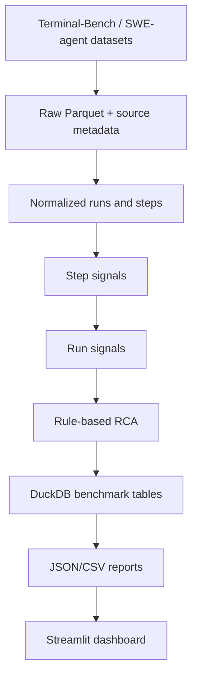

# Architecture

The OSS pipeline is file-backed and local. It reads raw Parquet, writes
dataset-specific normalized Parquet, materializes benchmark tables in separate
DuckDB files, and exports stable public artifacts for downstream display.
